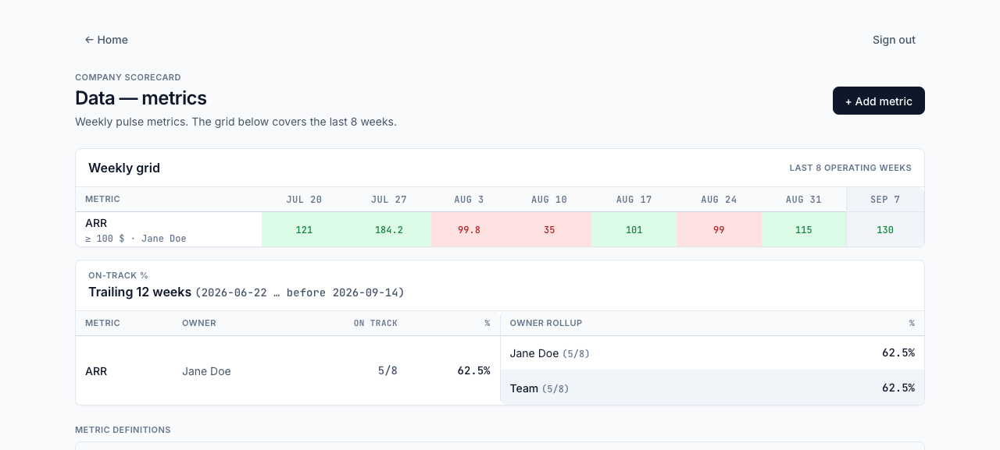
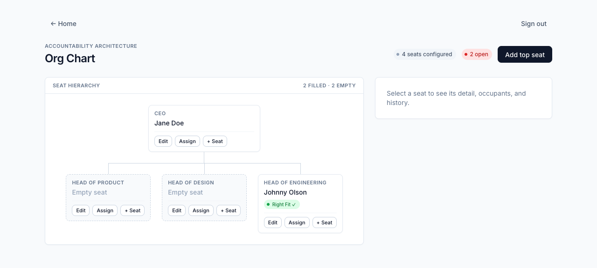
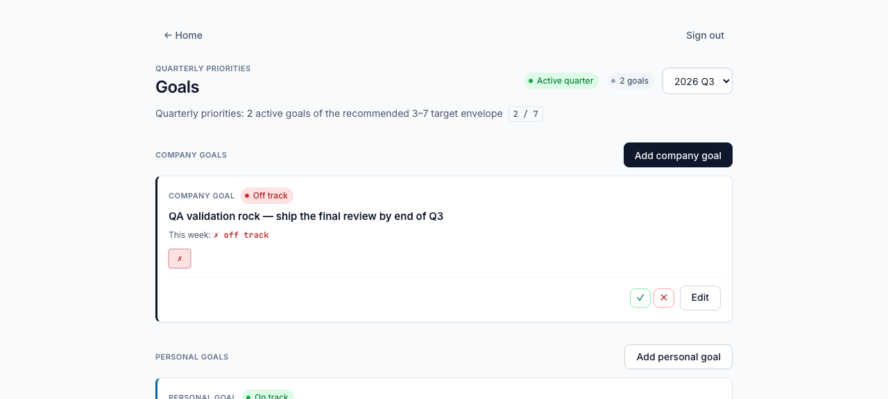

# Pilothouse

An open-source companion app for small companies running a leadership operating
system: an org chart with right-fit assessments, a versioned company vision
page, quarterly goals, a weekly metrics scorecard, an issues list, and a
facilitated weekly leadership meeting with a shared live view.

Pilothouse is an open-source tool inspired by the operating system described in
Gino Wickman's book *Traction*. It is not affiliated with, endorsed by, or
licensed by EOS Worldwide.

## Stack

- TanStack Start (SSR + server functions), React, Tailwind CSS
- SQLite via Drizzle ORM (Node's built-in `node:sqlite` — no native deps)
- Session auth (scrypt password hashing, httpOnly cookies)

All database access lives behind server modules; the client never touches the
DB, which keeps a future database swap contained.

## Screenshots

| Home — the command deck | Data — the weekly scorecard |
| --- | --- |
|  |  |

| Org Chart — seats & Right Fit | Goals — quarterly priorities |
| --- | --- |
|  |  |

## Setup

```bash
pnpm install
pnpm dev            # dev server (see port note below)
```

- Dev port: the dev script binds port 3000 (`pnpm dev`); if it's taken, run
  `node_modules/.bin/vite dev --port 3250` directly.
- On first run the app migrates the SQLite database (`data/pilothouse.db`),
  seeds an owner admin, and seeds EOS-style quarters for the current and next
  year.
- **Seed credentials (DEV-ONLY default):** `owner@pilothouse.local` /
  `pilothouse-owner-dev`. Override before first run with
  `PILOTHOUSE_OWNER_PASSWORD=<your password>` — never ship an instance with the
  default. (Databases created before the v1 rename keep their original
  `owner@pilothouse.local` seed email — existing rows are never migrated.)
- Then sign in, create your people on the People page, link logins, and add
  your second account via the Users page (admin).

## Scripts

| Command | What it does |
|---|---|
| `pnpm dev` | Dev server |
| `pnpm build` | Production build |
| `pnpm test` | Integration tests (node --test + tsx, temp SQLite per run) |
| `pnpm typecheck` | TypeScript, strict |
| `pnpm backup` | One-off SQLite snapshot into `data/backups/` |

The app also snapshots the database on server start and on an interval
(`PILOTHOUSE_BACKUP_INTERVAL_HOURS`, default 6).

## Environment variables

- `PILOTHOUSE_DB_PATH` — SQLite file location (default `data/pilothouse.db`)
- `PILOTHOUSE_OWNER_PASSWORD` — first-run owner password (dev default otherwise)
- `PILOTHOUSE_DISABLE_BACKUP` — set in tests to disable the snapshot job
- `PILOTHOUSE_BACKUP_INTERVAL_HOURS` — snapshot cadence

## Docs

- `docs/README.md` — documentation index (overview, data model, specs)
- `docs/qa-testing-plan.md` — manual QA plan covering every module

## License

MIT — see [LICENSE](./LICENSE).
