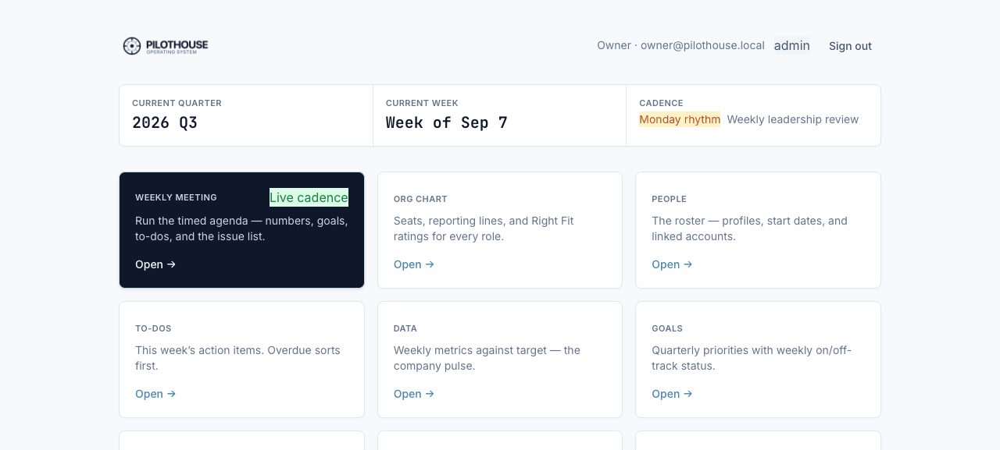

# Pilothouse

An open-source companion app for small companies running a leadership operating
system: an org chart with right-fit assessments, a versioned company vision
page, quarterly goals, a weekly metrics scorecard, an issues list, and a
facilitated weekly leadership meeting with a shared live view.

Pilothouse is an open-source tool inspired by the operating system described in
Gino Wickman's book *Traction*. It is not affiliated with, endorsed by, or
licensed by EOS Worldwide.

## Where Pilothouse came from

Pilothouse began with a single question asked to an AI coding assistant:

> **"Do you have really good knowledge of EOS, the Entrepreneurial Operating
> System, and the book *Traction*?"**

The answer was yes — along with a tour of the EOS toolkit that became this
app's blueprint:

- **The Six Key Components™** — Vision, People, Data, Issues, Process, and
  Traction — the framework everything else hangs off of.
- **The Vision/Traction Organizer (V/TO™)** — the eight-question vision page:
  core values, core focus, 10-year target, marketing strategy, 3-year picture,
  1-year plan, quarterly rocks, and the issues list.
- **Rocks** — quarterly priorities, capped at 7 company-wide and 3–7 per
  person, each with milestones and an on-track/off-track status.
- **The Scorecard** — a handful of weekly metrics, each owned by a named
  person with a concrete goal.
- **The Level 10 Meeting™** — the same 90-minute agenda every week: segue,
  scorecard, rock review, headlines, to-dos, then an hour of IDS on the
  issues list, ending with a recap of to-dos and cascading messages.
- **IDS** — Identify, Discuss, Solve: how issues actually get resolved
  instead of endlessly discussed.
- **To-dos** — weekly action items with a 7-day lifespan. Done or not —
  there's no "in progress."
- **Right people, right seats** — the Accountability Chart, with each seat
  scored GWC: *Get it, Want it, Capacity to do it*.

Those tools map directly onto Pilothouse's screens: Data → Scorecard,
Goals → Rocks, Issues → the Issues List, Company → the V/TO, Weekly Meeting →
the Level 10, and Org Chart & People → the Accountability Chart.

## Stack

- TanStack Start (SSR + server functions), React, Tailwind CSS
- SQLite via Drizzle ORM (Node's built-in `node:sqlite` — no native deps)
- Session auth (scrypt password hashing, httpOnly cookies)

All database access lives behind server modules; the client never touches the
DB, which keeps a future database swap contained.

## Screenshots



<p align="center"><em>A ~26-second tour of every screen (Data, To-Dos, Goals,
Issues, Company, Weekly Meeting, Org Chart, People, Employee Assessment).</em></p>

| Data — the weekly scorecard | Org Chart — seats & Right Fit | Goals — quarterly priorities |
| --- | --- | --- |
|  |  |  |

## Setup

```bash
pnpm install
pnpm dev            # dev server (see port note below)
```

- Dev port: the dev script binds port 3000 (`pnpm dev`); if it's taken, run
  `node_modules/.bin/vite dev --port 3250` directly.
- On first run the app migrates the SQLite database (`data/pilothouse.db`),
  seeds an owner admin, and seeds EOS-style quarters for the current and next
  year.
- **Seed credentials (DEV-ONLY default):** `owner@pilothouse.local` /
  `pilothouse-owner-dev`. Override before first run with
  `PILOTHOUSE_OWNER_PASSWORD=<your password>` — never ship an instance with the
  default. (Databases created before the v1 rename keep their original
  `owner@pilothouse.local` seed email — existing rows are never migrated.)
- Then sign in, create your people on the People page, link logins, and add
  your second account via the Users page (admin).

## Scripts

| Command | What it does |
|---|---|
| `pnpm dev` | Dev server |
| `pnpm build` | Production build |
| `pnpm test` | Integration tests (node --test + tsx, temp SQLite per run) |
| `pnpm typecheck` | TypeScript, strict |
| `pnpm backup` | One-off SQLite snapshot into `data/backups/` |

The app also snapshots the database on server start and on an interval
(`PILOTHOUSE_BACKUP_INTERVAL_HOURS`, default 6).

## Environment variables

- `PILOTHOUSE_DB_PATH` — SQLite file location (default `data/pilothouse.db`)
- `PILOTHOUSE_OWNER_PASSWORD` — first-run owner password (dev default otherwise)
- `PILOTHOUSE_DISABLE_BACKUP` — set in tests to disable the snapshot job
- `PILOTHOUSE_BACKUP_INTERVAL_HOURS` — snapshot cadence

## Docs

- `docs/README.md` — documentation index (overview, data model, specs)
- `docs/qa-testing-plan.md` — manual QA plan covering every module

## License

MIT — see [LICENSE](./LICENSE).
